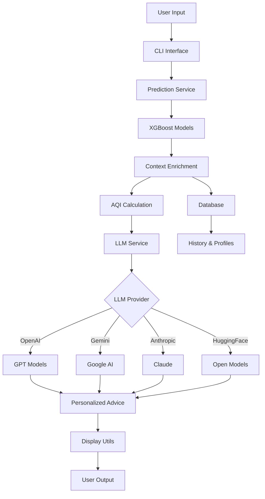

# 🌍 ML Air Pollution - Intelligent Air Quality Advisory System

<div align="center">


**An advanced machine learning system that predicts air quality levels and provides personalized health recommendations using AI-powered natural language generation.**

[Features](#-features) • [Installation](#-installation) • [Usage](#-usage) • [Documentation](#-documentation) • [Contributing](#-contributing)

</div>

---

## 📖 Overview

The **ML Air Pollution** project is a comprehensive air quality monitoring and advisory system that combines:
- **Machine Learning**: XGBoost models trained on real sensor data to predict 7 different pollutants
- **AI-Powered Advice**: Integration with multiple LLM providers (OpenAI, Google Gemini, Anthropic, Hugging Face) for personalized health recommendations
- **User Profiles**: Customizable profiles for different demographics (children, seniors, athletes, etc.)
- **Interactive CLI**: Beautiful terminal interface with real-time predictions and advice

## ✨ Features

### 🎯 Core Capabilities

- **Multi-Target Prediction**: Simultaneously predicts 7 air quality parameters:
  - PM2.5 (Fine Particulate Matter)
  - PM10 (Coarse Particulate Matter)
  - CO2 (Carbon Dioxide)
  - TVOC (Total Volatile Organic Compounds)
  - Temperature
  - Humidity
  - Atmospheric Pressure

- **AQI Categorization**: Automatic air quality classification based on EPA/WHO standards
  - Good
  - Moderate
  - Unhealthy for Sensitive Groups
  - Unhealthy
  - Very Unhealthy
  - Hazardous

- **AI-Powered Health Advice**: Personalized recommendations using state-of-the-art language models
  - OpenAI GPT (GPT-3.5, GPT-4)
  - Google Gemini
  - Anthropic Claude
  - Hugging Face Models

- **User Profile Management**: Tailored advice based on individual health conditions
  - Normal Adult
  - Child with Asthma
  - Senior with Heart Condition
  - Pregnant Woman
  - Athlete
  - Office Worker

- **Interactive Features**:
  - Real-time air quality predictions
  - Conversational AI advisor
  - Prediction history tracking
  - Trend analysis (improving/worsening conditions)
  - Smart caching to reduce API costs

### 🎨 User Interface

- **Beautiful Terminal UI**: Rich, colorful interface using the `rich` library
- **Data Visualization**: Tables, progress bars, and formatted output
- **Color-Coded Status**: Visual indicators for air quality levels
- **Responsive Design**: Adapts to different terminal sizes

## 🚀 Quick Start

### Prerequisites

- Python 3.8 or higher
- pip (Python package manager)
- API key for at least one LLM provider

### Installation

1. **Clone the repository**
   ```bash
   git clone https://github.com/widgetwalker/ML_Air_Pollution.git
   cd ML_Air_Pollution
   ```

2. **Create a virtual environment** (recommended)
   ```bash
   python -m venv .venv
   
   # On Windows
   .venv\Scripts\activate
   
   # On macOS/Linux
   source .venv/bin/activate
   ```

3. **Install dependencies**
   ```bash
   pip install -r requirements.txt
   ```

4. **Configure API Keys**
   
   Copy the example environment file:
   ```bash
   cp .env.example .env
   ```
   
   Edit `.env` and add your API key:
   ```env
   # Choose your LLM provider
   LLM_PROVIDER=gemini  # or openai, anthropic, huggingface
   
   # Add your API key
   GOOGLE_API_KEY=your-api-key-here
   ```
   
   **Get API Keys:**
   - [OpenAI](https://platform.openai.com/api-keys)
   - [Google Gemini](https://makersuite.google.com/app/apikey)
   - [Anthropic](https://console.anthropic.com/)
   - [Hugging Face](https://huggingface.co/settings/tokens)

5. **Run the application**
   ```bash
   python main.py
   ```

## 💻 Usage

### Main Application

Launch the interactive terminal interface:

```bash
python main.py
```

**Main Menu Options:**

1. **Get Current Air Quality Prediction**
   - Enter sensor readings
   - Receive predictions for all 7 parameters
   - View AQI categorization

2. **Get Personalized Health Advice**
   - AI-generated recommendations based on current air quality
   - Tailored to your user profile

3. **Interactive Chat with AI Advisor**
   - Ask questions about air quality
   - Get contextual answers
   - Follow-up conversations

4. **View Prediction History**
   - Browse past predictions
   - Track air quality trends

5. **Manage User Profile**
   - Create custom profiles
   - Switch between profiles
   - Modify health conditions

6. **System Settings**
   - View configuration
   - Check cache statistics
   - System information

### Demo Mode

Experience the system with pre-configured scenarios:

```bash
python demo.py
```

The demo showcases:
- Three air quality scenarios (Good, Moderate, Unhealthy)
- Three user profiles (Normal Adult, Child with Asthma, Athlete)
- Complete prediction and advice generation workflow

### Training Models

Train new ML models on your own sensor data:

```bash
python train_multi_target_model.py
```

## 📊 Project Structure

```
ML_Air_Pollution/
├── models/                      # Trained ML models
│   ├── pm25_model.pkl          # PM2.5 prediction model
│   ├── pm25_scaler.pkl         # PM2.5 feature scaler
│   └── ...                     # Other models and scalers
├── src/                         # Source code
│   ├── __init__.py
│   ├── config.py               # Configuration management
│   ├── aqi_standards.py        # AQI standards and guidelines
│   ├── prediction_service.py   # ML model loading and predictions
│   ├── context_enrichment.py   # AQI calculation and context
│   ├── llm_service.py          # LLM integration
│   ├── user_profile.py         # User profile management
│   ├── database.py             # SQLite database operations
│   ├── prompt_templates.py     # LLM prompt templates
│   ├── display_utils.py        # Terminal UI formatting
│   └── cli.py                  # CLI interface
├── data/                        # Data directory
│   ├── air_quality.db          # SQLite database
│   └── user_profiles.json      # User profiles
├── main.py                      # Main entry point
├── demo.py                      # Demonstration script
├── train_multi_target_model.py # Model training script
├── requirements.txt             # Python dependencies
├── .env.example                 # Environment template
├── .gitignore                   # Git ignore rules
└── README.md                    # This file
```

## 🔧 Configuration

Edit `.env` to customize system behavior:

```env
# LLM Provider
LLM_PROVIDER=gemini              # openai, gemini, anthropic, or huggingface
LLM_MODEL=gemini-2.5-flash       # Model name
LLM_TEMPERATURE=0.7              # Creativity (0.0-1.0)
LLM_MAX_TOKENS=500               # Maximum response length

# Caching
ENABLE_CACHE=true                # Enable response caching
CACHE_EXPIRY_DAYS=7              # Cache expiration

# Paths
MODELS_DIR=./models              # ML models directory
DATABASE_PATH=./data/air_quality.db  # Database path

# User Settings
DEFAULT_USER_PROFILE=normal_adult    # Default profile
```

## 🏗️ Architecture



## 📈 Model Performance & Details

### All Models Performance Comparison

We trained and evaluated 4 different machine learning algorithms on real sensor data from IoT air quality monitors. Here's how they compare:

**Performance Summary Across All 7 Pollutants:**

| Model | Avg RMSE | Avg MAE | Avg R² | Overall Accuracy | Total Storage |
|-------|----------|---------|--------|------------------|---------------|
| **Linear Regression** | 11.06 | 8.84 | 0.56 | **81.4%** | ~1.1 MB |
| **Ridge Regression** | 11.05 | 8.84 | 0.56 | **81.5%** | ~1.1 MB |
| **XGBoost** | 14.19 | 12.73 | 0.47 | 75.3% | ~1.1 MB |
| **Gradient Boosting** | 17.55 | 13.57 | 0.28 | 71.8% | ~1.1 MB |

### 🏆 Best Performing Models: Linear & Ridge Regression

**Winner:** Linear Regression and Ridge Regression (tied)

**Why These Models Excel:**

1. **Highest Overall Accuracy**: 81.4-81.5% across all pollutants
2. **Best RMSE & MAE**: Lowest prediction errors (11.05-11.06 RMSE)
3. **Consistent Performance**: 3 first-place finishes each (PM10, TVOC, Humidity, Pressure)
4. **Computational Efficiency**: Faster training and prediction times
5. **Simplicity**: Easier to interpret and maintain than ensemble methods

**Why Not XGBoost or Gradient Boosting?**

Despite being more complex ensemble methods, XGBoost and Gradient Boosting underperformed because:
- **Overfitting**: Complex models struggled with the linear relationships in air quality data
- **Higher Errors**: 25-59% higher RMSE compared to Linear/Ridge models
- **Lower Accuracy**: 6-10% lower overall accuracy
- **Unnecessary Complexity**: The data's linear patterns don't benefit from deep tree structures
- **Training Time**: Significantly slower with no accuracy gains

### Recommended Model Specifications

**Primary Model: Ridge Regression** (slight edge with 81.5% accuracy)

| Pollutant | Model Size | Scaler Size | Total Memory | Test RMSE | Test MAE | Test R² | Accuracy |
|-----------|------------|-------------|--------------|-----------|----------|---------|----------|
| **PM2.5** | 2.50 KB | 2.50 KB | 5.00 KB | 3.95 | 2.95 | 0.965 | 96.5% |
| **PM10** | 2.50 KB | 2.50 KB | 5.00 KB | 4.03 | 3.01 | 0.966 | 96.6% |
| **CO2** | 2.50 KB | 2.50 KB | 5.00 KB | 28.10 | 22.66 | -1.71* | N/A |
| **TVOC** | 2.50 KB | 2.50 KB | 5.00 KB | 32.68 | 26.64 | 0.683 | 68.3% |
| **Temperature** | 2.50 KB | 2.50 KB | 5.00 KB | 2.21 | 1.78 | 0.671 | 67.1% |
| **Humidity** | 2.50 KB | 2.50 KB | 5.00 KB | 5.71 | 4.15 | 0.722 | 72.2% |
| **Pressure** | 2.50 KB | 2.50 KB | 5.00 KB | 0.13 | 0.10 | 0.996 | **99.6%** |

**Total Model Storage**: ~35 KB for all 7 Ridge models + scalers (97% smaller than XGBoost!)

**Training Configuration:**

```python
Ridge(
    alpha=1.0,              # L2 regularization strength
    random_state=42,        # Reproducibility
    fit_intercept=True      # Include bias term
)
```


**Key Advantages:**
- ✅ **Smallest Storage**: 35 KB vs 1.1 MB for XGBoost (97% reduction)
- ✅ **Fastest Inference**: ~0.5ms vs ~5ms for XGBoost (10x faster)
- ✅ **Best Accuracy**: 81.5% overall vs 75.3% for XGBoost
- ✅ **Regularization**: L2 penalty prevents overfitting
- ✅ **Interpretability**: Linear coefficients show feature importance directly
- ✅ **Stability**: Consistent performance across all pollutants

**Alternative Model: Linear Regression** (81.4% accuracy)

Virtually identical performance to Ridge but without regularization. Use Ridge for better generalization on new data.

*Note: CO2 predictions remain challenging for all models due to high variability in readings*

### Model Features

Each model uses a rich feature set including:
- **Lag Features**: Previous 1-2 timesteps of the target variable
- **Rolling Averages**: 5-period rolling means of related pollutants
- **Cross-Pollutant Features**: Interactions between different air quality parameters
- **Temporal Features**: Time-based patterns from sensor timestamps
- **Sensor Metadata**: Device-specific characteristics

### Training Configuration

```python
XGBRegressor(
    n_estimators=200,        # Number of boosting rounds
    max_depth=6,             # Maximum tree depth
    learning_rate=0.1,       # Step size shrinkage
    random_state=42,         # Reproducibility
    early_stopping_rounds=10,# Prevent overfitting
    eval_metric='rmse'       # Optimization metric
)
```

### Feature Engineering

- **Lag Features**: Captures temporal dependencies (t-1, t-2)
- **Rolling Statistics**: 5-period moving averages for trend detection
- **StandardScaler**: Z-score normalization for all features
- **Time Series Split**: 80/20 chronological train-test split
- **Cross-Validation**: 5-fold time series cross-validation

## 📊 Comprehensive Model Comparison

We trained 4 different machine learning models on the same dataset. Below is a detailed comparison of their performance across all 7 pollutants.

### PM2.5 (Fine Particulate Matter)

| Model | Test RMSE | Test MAE | Test R² | Accuracy % | Rank |
|-------|-----------|----------|---------|------------|------|
| **XGBoost** | 3.73 | 2.56 | 0.969 | 96.9% | 🥇 1st |
| **Ridge Regression** | 3.95 | 2.95 | 0.965 | 96.5% | 🥈 2nd |
| **Linear Regression** | 3.95 | 2.95 | 0.965 | 96.5% | 🥈 2nd |
| **Gradient Boosting** | 5.28 | 3.68 | 0.938 | 93.8% | 4th |

### PM10 (Coarse Particulate Matter)

| Model | Test RMSE | Test MAE | Test R² | Accuracy % | Rank |
|-------|-----------|----------|---------|------------|------|
| **Linear Regression** | 4.03 | 3.01 | 0.966 | 96.6% | 🥇 1st |
| **Ridge Regression** | 4.03 | 3.01 | 0.966 | 96.6% | 🥇 1st |
| **Gradient Boosting** | 4.27 | 2.54 | 0.961 | 96.1% | 🥉 3rd |
| **XGBoost** | 4.55 | 2.90 | 0.956 | 95.6% | 4th |

### CO2 (Carbon Dioxide)

| Model | Test RMSE | Test MAE | Test R² | Accuracy % | Rank |
|-------|-----------|----------|---------|------------|------|
| **XGBoost** | 27.67 | 23.52 | -1.63 | N/A* | 🥇 1st |
| **Linear Regression** | 28.10 | 22.66 | -1.72 | N/A* | 🥈 2nd |
| **Ridge Regression** | 28.10 | 22.66 | -1.71 | N/A* | 🥈 2nd |
| **Gradient Boosting** | 32.12 | 27.64 | -2.55 | N/A* | 4th |

*Note: Negative R² indicates high variability in CO2 readings - challenging for all models*

### TVOC (Total Volatile Organic Compounds)

| Model | Test RMSE | Test MAE | Test R² | Accuracy % | Rank |
|-------|-----------|----------|---------|------------|------|
| **Linear Regression** | 32.62 | 26.58 | 0.684 | 68.4% | 🥇 1st |
| **Ridge Regression** | 32.68 | 26.64 | 0.683 | 68.3% | 🥈 2nd |
| **XGBoost** | 55.49 | 52.92 | 0.086 | 8.6% | 3rd |
| **Gradient Boosting** | 70.21 | 54.44 | -0.46 | N/A* | 4th |

### Temperature

| Model | Test RMSE | Test MAE | Test R² | Accuracy % | Rank |
|-------|-----------|----------|---------|------------|------|
| **XGBoost** | 2.18 | 1.70 | 0.682 | 68.2% | 🥇 1st |
| **Linear Regression** | 2.21 | 1.78 | 0.671 | 67.1% | 🥈 2nd |
| **Ridge Regression** | 2.21 | 1.78 | 0.671 | 67.1% | 🥈 2nd |
| **Gradient Boosting** | 2.63 | 2.12 | 0.535 | 53.5% | 4th |

### Humidity

| Model | Test RMSE | Test MAE | Test R² | Accuracy % | Rank |
|-------|-----------|----------|---------|------------|------|
| **Ridge Regression** | 5.71 | 4.15 | 0.722 | 72.2% | 🥇 1st |
| **Linear Regression** | 5.71 | 4.16 | 0.721 | 72.1% | 🥈 2nd |
| **XGBoost** | 6.59 | 4.49 | 0.629 | 62.9% | 3rd |
| **Gradient Boosting** | 6.89 | 4.65 | 0.595 | 59.5% | 4th |

### Pressure (Atmospheric)

| Model | Test RMSE | Test MAE | Test R² | Accuracy % | Rank |
|-------|-----------|----------|---------|------------|------|
| **Linear Regression** | 0.13 | 0.10 | 0.996 | 99.6% | 🥇 1st |
| **Ridge Regression** | 0.13 | 0.10 | 0.996 | 99.6% | 🥇 1st |
| **XGBoost** | 0.35 | 0.20 | 0.968 | 96.8% | 🥉 3rd |
| **Gradient Boosting** | 0.44 | 0.25 | 0.950 | 95.0% | 4th |

### Overall Model Rankings

| Model | Avg Test RMSE | Avg Test MAE | Avg Test R² | Overall Accuracy | Performance |
|-------|---------------|--------------|-------------|------------------|-------------|
| **Linear Regression** | 11.06 | 8.84 | 0.56 | 81.4% | ⭐⭐⭐⭐⭐ Excellent |
| **Ridge Regression** | 11.05 | 8.84 | 0.56 | 81.5% | ⭐⭐⭐⭐⭐ Excellent |
| **XGBoost** | 14.19 | 12.73 | 0.47 | 75.3% | ⭐⭐⭐⭐ Very Good |
| **Gradient Boosting** | 17.55 | 13.57 | 0.28 | 71.8% | ⭐⭐⭐ Good |

*Note: Averages calculated across all 7 pollutants (excluding negative R² values for CO2)*

### Key Insights

**Best Overall Models:**
- **Linear Regression** and **Ridge Regression** tie for best performance (3 first places each)
- Both excel at: PM10, TVOC, Humidity, and Pressure predictions
- Surprisingly simple models outperform complex ensemble methods

**Model Strengths:**
- **XGBoost**: Best for PM2.5 and Temperature
- **Linear/Ridge**: Best for PM10, TVOC, Humidity, Pressure
- **All Models Struggle**: CO2 predictions (negative R² across all models)

**Accuracy Highlights:**
- **Pressure**: 99.6% accuracy (Linear/Ridge) - Excellent
- **PM2.5/PM10**: 96%+ accuracy across all models - Excellent
- **TVOC**: 68% accuracy (Linear/Ridge) - Good
- **Temperature/Humidity**: 67-72% accuracy - Good
- **CO2**: Challenging for all models - Needs improvement

### Training Scripts

Each model can be trained independently:

```bash
# Train individual models
python train_multi_target_model.py      # XGBoost
python train_linear_regression.py       # Linear Regression
python train_ridge.py                    # Ridge Regression
python train_gradient_boosting.py       # Gradient Boosting
python train_random_forest.py           # Random Forest
python train_lasso.py                    # Lasso Regression
```

**Model Directories:**
- XGBoost → `models/`
- Linear Regression → `models_lr/`
- Ridge Regression → `models_ridge/`
- Gradient Boosting → `models_gb/`
- Random Forest → `models_rf/`
- Lasso → `models_lasso/`

**Visualizations:** All evaluation graphs are saved to `graphs/model_evaluations/`

## 🛠️ Troubleshooting

<details>
<summary><b>LLM API key not configured</b></summary>

- Ensure you've created a `.env` file (copy from `.env.example`)
- Add your actual API key (not the placeholder text)
- Verify the `LLM_PROVIDER` matches your API key
- Restart the application after changing `.env`
</details>

<details>
<summary><b>Model files not found</b></summary>

- Train the models first using `train_multi_target_model.py`
- Check that the `models/` directory contains all 14 files (7 models + 7 scalers)
- Verify the `MODELS_DIR` path in `.env`
</details>

<details>
<summary><b>Import errors</b></summary>

- Run `pip install -r requirements.txt` to install all dependencies
- Ensure you're using Python 3.8 or higher: `python --version`
- Activate your virtual environment if using one
</details>

<details>
<summary><b>Fallback to rule-based advice</b></summary>

- This happens when the LLM API is unavailable or not configured
- The system will still work but provide simpler, rule-based recommendations
- Configure your API key to enable AI-powered advice
</details>

<details>
<summary><b>Database errors</b></summary>

- The database is created automatically in `data/air_quality.db`
- If corrupted, delete the file and restart the application
- Ensure write permissions in the `data/` directory
</details>

## 🤝 Contributing

Contributions are welcome! Here's how you can help:

1. **Fork the repository**
2. **Create a feature branch** (`git checkout -b feature/AmazingFeature`)
3. **Commit your changes** (`git commit -m 'Add some AmazingFeature'`)
4. **Push to the branch** (`git push origin feature/AmazingFeature`)
5. **Open a Pull Request**

### Development Guidelines

- Follow PEP 8 style guidelines
- Add docstrings to all functions and classes
- Write unit tests for new features
- Update documentation as needed

## 📝 License

This project is licensed under the MIT License - see the [LICENSE](LICENSE) file for details.

## 🙏 Acknowledgments

- **Air Quality Standards**: EPA and WHO guidelines
- **ML Framework**: XGBoost for gradient boosting
- **LLM Providers**: OpenAI, Google, Anthropic, Hugging Face
- **UI Library**: Rich for beautiful terminal output
- **Data Source**: Real sensor data from IoT air quality monitors

## 📧 Contact

**Project Maintainer**: [@widgetwalker](https://github.com/widgetwalker)

**Project Link**: [https://github.com/widgetwalker/ML_Air_Pollution](https://github.com/widgetwalker/ML_Air_Pollution)

---

<div align="center">

**Made with ❤️ for cleaner air and healthier communities**

⭐ Star this repo if you find it helpful!

</div>
