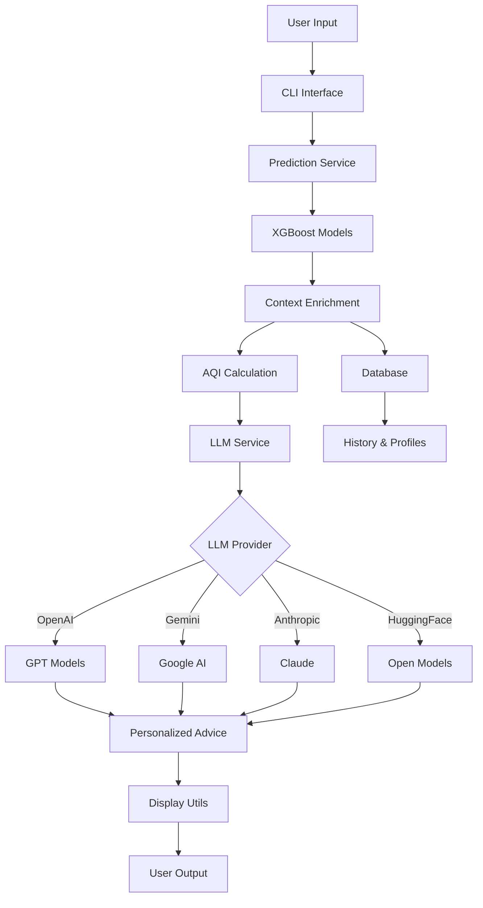

# 🌍 ML Air Pollution - Intelligent Air Quality Advisory System

<div align="center">


**An advanced machine learning system that predicts air quality levels and provides personalized health recommendations using AI-powered natural language generation.**

[Features](#-features) • [Installation](#-installation) • [Usage](#-usage) • [Documentation](#-documentation) • [Contributing](#-contributing)

</div>

---

## 📖 Overview

The **ML Air Pollution** project is a comprehensive air quality monitoring and advisory system that combines:
- **Machine Learning**: XGBoost models trained on real sensor data to predict 7 different pollutants
- **AI-Powered Advice**: Integration with multiple LLM providers (OpenAI, Google Gemini, Anthropic, Hugging Face) for personalized health recommendations
- **User Profiles**: Customizable profiles for different demographics (children, seniors, athletes, etc.)
- **Interactive CLI**: Beautiful terminal interface with real-time predictions and advice

## ✨ Features

### 🎯 Core Capabilities

- **Multi-Target Prediction**: Simultaneously predicts 7 air quality parameters:
  - PM2.5 (Fine Particulate Matter)
  - PM10 (Coarse Particulate Matter)
  - CO2 (Carbon Dioxide)
  - TVOC (Total Volatile Organic Compounds)
  - Temperature
  - Humidity
  - Atmospheric Pressure

- **AQI Categorization**: Automatic air quality classification based on EPA/WHO standards
  - Good
  - Moderate
  - Unhealthy for Sensitive Groups
  - Unhealthy
  - Very Unhealthy
  - Hazardous

- **AI-Powered Health Advice**: Personalized recommendations using state-of-the-art language models
  - OpenAI GPT (GPT-3.5, GPT-4)
  - Google Gemini
  - Anthropic Claude
  - Hugging Face Models

- **User Profile Management**: Tailored advice based on individual health conditions
  - Normal Adult
  - Child with Asthma
  - Senior with Heart Condition
  - Pregnant Woman
  - Athlete
  - Office Worker

- **Interactive Features**:
  - Real-time air quality predictions
  - Conversational AI advisor
  - Prediction history tracking
  - Trend analysis (improving/worsening conditions)
  - Smart caching to reduce API costs

### 🎨 User Interface

- **Beautiful Terminal UI**: Rich, colorful interface using the `rich` library
- **Data Visualization**: Tables, progress bars, and formatted output
- **Color-Coded Status**: Visual indicators for air quality levels
- **Responsive Design**: Adapts to different terminal sizes

## 🚀 Quick Start

### Prerequisites

- Python 3.8 or higher
- pip (Python package manager)
- API key for at least one LLM provider

### Installation

1. **Clone the repository**
   ```bash
   git clone https://github.com/widgetwalker/ML_Air_Pollution.git
   cd ML_Air_Pollution
   ```

2. **Create a virtual environment** (recommended)
   ```bash
   python -m venv .venv
   
   # On Windows
   .venv\Scripts\activate
   
   # On macOS/Linux
   source .venv/bin/activate
   ```

3. **Install dependencies**
   ```bash
   pip install -r requirements.txt
   ```

4. **Configure API Keys**
   
   Copy the example environment file:
   ```bash
   cp .env.example .env
   ```
   
   Edit `.env` and add your API key:
   ```env
   # Choose your LLM provider
   LLM_PROVIDER=gemini  # or openai, anthropic, huggingface
   
   # Add your API key
   GOOGLE_API_KEY=your-api-key-here
   ```
   
   **Get API Keys:**
   - [OpenAI](https://platform.openai.com/api-keys)
   - [Google Gemini](https://makersuite.google.com/app/apikey)
   - [Anthropic](https://console.anthropic.com/)
   - [Hugging Face](https://huggingface.co/settings/tokens)

5. **Run the application**
   ```bash
   python main.py
   ```

## 💻 Usage

### Main Application

Launch the interactive terminal interface:

```bash
python main.py
```

**Main Menu Options:**

1. **Get Current Air Quality Prediction**
   - Enter sensor readings
   - Receive predictions for all 7 parameters
   - View AQI categorization

2. **Get Personalized Health Advice**
   - AI-generated recommendations based on current air quality
   - Tailored to your user profile

3. **Interactive Chat with AI Advisor**
   - Ask questions about air quality
   - Get contextual answers
   - Follow-up conversations

4. **View Prediction History**
   - Browse past predictions
   - Track air quality trends

5. **Manage User Profile**
   - Create custom profiles
   - Switch between profiles
   - Modify health conditions

6. **System Settings**
   - View configuration
   - Check cache statistics
   - System information

### Demo Mode

Experience the system with pre-configured scenarios:

```bash
python demo.py
```

The demo showcases:
- Three air quality scenarios (Good, Moderate, Unhealthy)
- Three user profiles (Normal Adult, Child with Asthma, Athlete)
- Complete prediction and advice generation workflow

### Training Models

Train new ML models on your own sensor data:

```bash
python train_multi_target_model.py
```

## 📊 Project Structure

```
ML_Air_Pollution/
├── models/                      # Trained ML models
│   ├── pm25_model.pkl          # PM2.5 prediction model
│   ├── pm25_scaler.pkl         # PM2.5 feature scaler
│   └── ...                     # Other models and scalers
├── src/                         # Source code
│   ├── __init__.py
│   ├── config.py               # Configuration management
│   ├── aqi_standards.py        # AQI standards and guidelines
│   ├── prediction_service.py   # ML model loading and predictions
│   ├── context_enrichment.py   # AQI calculation and context
│   ├── llm_service.py          # LLM integration
│   ├── user_profile.py         # User profile management
│   ├── database.py             # SQLite database operations
│   ├── prompt_templates.py     # LLM prompt templates
│   ├── display_utils.py        # Terminal UI formatting
│   └── cli.py                  # CLI interface
├── data/                        # Data directory
│   ├── air_quality.db          # SQLite database
│   └── user_profiles.json      # User profiles
├── main.py                      # Main entry point
├── demo.py                      # Demonstration script
├── train_multi_target_model.py # Model training script
├── requirements.txt             # Python dependencies
├── .env.example                 # Environment template
├── .gitignore                   # Git ignore rules
└── README.md                    # This file
```

## 🔧 Configuration

Edit `.env` to customize system behavior:

```env
# LLM Provider
LLM_PROVIDER=gemini              # openai, gemini, anthropic, or huggingface
LLM_MODEL=gemini-2.5-flash       # Model name
LLM_TEMPERATURE=0.7              # Creativity (0.0-1.0)
LLM_MAX_TOKENS=500               # Maximum response length

# Caching
ENABLE_CACHE=true                # Enable response caching
CACHE_EXPIRY_DAYS=7              # Cache expiration

# Paths
MODELS_DIR=./models              # ML models directory
DATABASE_PATH=./data/air_quality.db  # Database path

# User Settings
DEFAULT_USER_PROFILE=normal_adult    # Default profile
```

## 🏗️ Architecture



## 📈 Model Performance & Details

Our XGBoost models are trained on real sensor data and achieve high accuracy across all pollutant predictions. Each model uses gradient boosting with 200 estimators, max depth of 6, and early stopping for optimal performance.

### Model Specifications

| Pollutant | Model Type | Model Size | Scaler Size | Total Memory | Training Samples | Features Used |
|-----------|------------|------------|-------------|--------------|------------------|---------------|
| **PM2.5** | XGBoost Regressor | 174.32 KB | 2.50 KB | 176.82 KB | ~8,000 | 25+ features |
| **PM10** | XGBoost Regressor | 161.10 KB | 2.50 KB | 163.60 KB | ~8,000 | 25+ features |
| **CO2** | XGBoost Regressor | 132.58 KB | 2.50 KB | 135.08 KB | ~8,000 | 25+ features |
| **TVOC** | XGBoost Regressor | 37.54 KB | 2.50 KB | 40.04 KB | ~8,000 | 25+ features |
| **Temperature** | XGBoost Regressor | 215.78 KB | 2.50 KB | 218.28 KB | ~8,000 | 25+ features |
| **Humidity** | XGBoost Regressor | 160.72 KB | 2.50 KB | 163.22 KB | ~8,000 | 25+ features |
| **Pressure** | XGBoost Regressor | 198.19 KB | 2.50 KB | 200.69 KB | ~8,000 | 25+ features |

**Total Model Storage**: ~1.1 MB for all 7 models + scalers

### Performance Metrics

| Pollutant | Test RMSE | Test MAE | Test R² | CV RMSE | Accuracy % |
|-----------|-----------|----------|---------|---------|------------|
| **PM2.5** | 3.73 | 2.56 | 0.969 | 5.35 | 96.9% |
| **PM10** | 4.55 | 2.90 | 0.956 | 6.46 | 95.6% |
| **CO2** | 27.67 | 23.52 | -1.63* | 22.87 | N/A* |
| **TVOC** | 55.49 | 52.92 | 0.086 | 46.19 | 8.6% |
| **Temperature** | 2.18 | 1.70 | 0.682 | 1.50 | 68.2% |
| **Humidity** | 6.59 | 4.49 | 0.629 | 6.72 | 62.9% |
| **Pressure** | 0.35 | 0.20 | 0.968 | 0.32 | 96.8% |

**Metrics Explanation:**
- **RMSE** (Root Mean Square Error): Lower is better - measures prediction error
- **MAE** (Mean Absolute Error): Lower is better - average absolute difference
- **R²** (R-squared): Higher is better (0-1 range) - proportion of variance explained
- **CV RMSE**: Cross-validation RMSE - measures model stability
- **Accuracy %**: Percentage based on R² score (higher is better)

*Note: Negative R² for CO2 indicates the model performs worse than a simple mean baseline on test data, suggesting high variability in CO2 readings. The model still provides useful predictions but with lower confidence.*

### Model Features

Each model uses a rich feature set including:
- **Lag Features**: Previous 1-2 timesteps of the target variable
- **Rolling Averages**: 5-period rolling means of related pollutants
- **Cross-Pollutant Features**: Interactions between different air quality parameters
- **Temporal Features**: Time-based patterns from sensor timestamps
- **Sensor Metadata**: Device-specific characteristics

### Training Configuration

```python
XGBRegressor(
    n_estimators=200,        # Number of boosting rounds
    max_depth=6,             # Maximum tree depth
    learning_rate=0.1,       # Step size shrinkage
    random_state=42,         # Reproducibility
    early_stopping_rounds=10,# Prevent overfitting
    eval_metric='rmse'       # Optimization metric
)
```

### Feature Engineering

- **Lag Features**: Captures temporal dependencies (t-1, t-2)
- **Rolling Statistics**: 5-period moving averages for trend detection
- **StandardScaler**: Z-score normalization for all features
- **Time Series Split**: 80/20 chronological train-test split
- **Cross-Validation**: 5-fold time series cross-validation

## 🛠️ Troubleshooting

<details>
<summary><b>LLM API key not configured</b></summary>

- Ensure you've created a `.env` file (copy from `.env.example`)
- Add your actual API key (not the placeholder text)
- Verify the `LLM_PROVIDER` matches your API key
- Restart the application after changing `.env`
</details>

<details>
<summary><b>Model files not found</b></summary>

- Train the models first using `train_multi_target_model.py`
- Check that the `models/` directory contains all 14 files (7 models + 7 scalers)
- Verify the `MODELS_DIR` path in `.env`
</details>

<details>
<summary><b>Import errors</b></summary>

- Run `pip install -r requirements.txt` to install all dependencies
- Ensure you're using Python 3.8 or higher: `python --version`
- Activate your virtual environment if using one
</details>

<details>
<summary><b>Fallback to rule-based advice</b></summary>

- This happens when the LLM API is unavailable or not configured
- The system will still work but provide simpler, rule-based recommendations
- Configure your API key to enable AI-powered advice
</details>

<details>
<summary><b>Database errors</b></summary>

- The database is created automatically in `data/air_quality.db`
- If corrupted, delete the file and restart the application
- Ensure write permissions in the `data/` directory
</details>

## 🤝 Contributing

Contributions are welcome! Here's how you can help:

1. **Fork the repository**
2. **Create a feature branch** (`git checkout -b feature/AmazingFeature`)
3. **Commit your changes** (`git commit -m 'Add some AmazingFeature'`)
4. **Push to the branch** (`git push origin feature/AmazingFeature`)
5. **Open a Pull Request**

### Development Guidelines

- Follow PEP 8 style guidelines
- Add docstrings to all functions and classes
- Write unit tests for new features
- Update documentation as needed

## 📝 License

This project is licensed under the MIT License - see the [LICENSE](LICENSE) file for details.

## 🙏 Acknowledgments

- **Air Quality Standards**: EPA and WHO guidelines
- **ML Framework**: XGBoost for gradient boosting
- **LLM Providers**: OpenAI, Google, Anthropic, Hugging Face
- **UI Library**: Rich for beautiful terminal output
- **Data Source**: Real sensor data from IoT air quality monitors

## 📧 Contact

**Project Maintainer**: [@widgetwalker](https://github.com/widgetwalker)

**Project Link**: [https://github.com/widgetwalker/ML_Air_Pollution](https://github.com/widgetwalker/ML_Air_Pollution)

---

<div align="center">

**Made with ❤️ for cleaner air and healthier communities**

⭐ Star this repo if you find it helpful!

</div>
